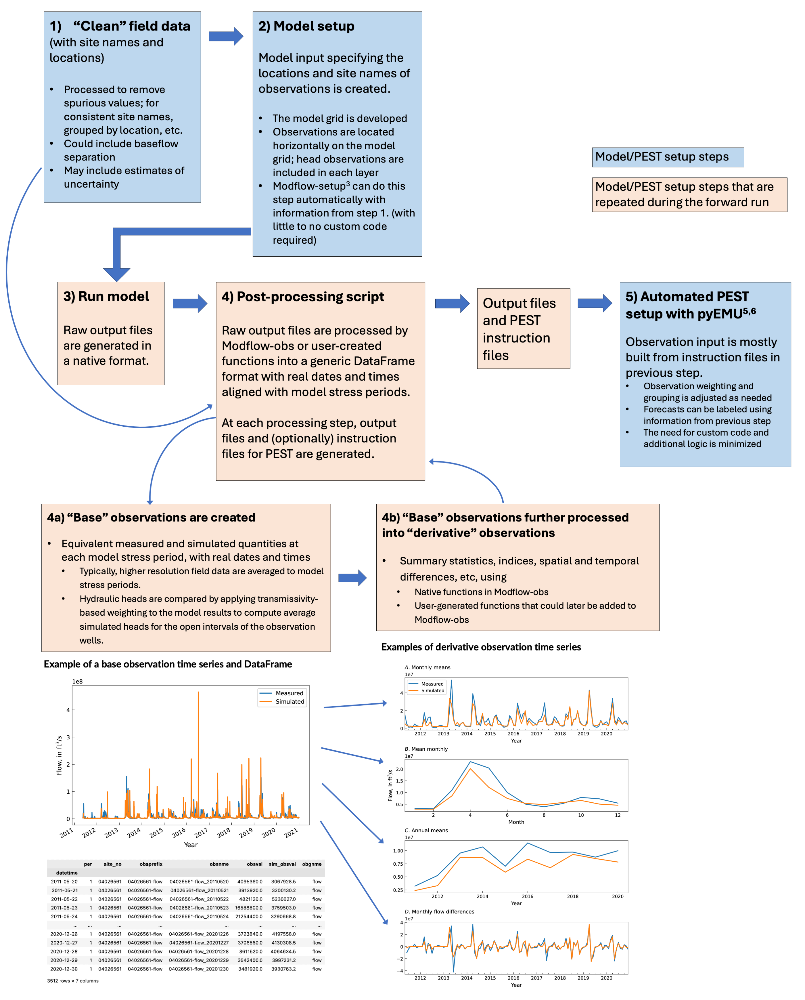

Overview
==========

Motivation
----------
* Successful decision support modeling requires extracting all available information about a system, including measurements of system state (through history matching with PEST or PEST++, for example). 
* To do this, we need to create an objective function of *observations* that compare **equivalent** measured and simulated quantities. 
* For transient models with many field measurements (and many model outputs), we probably also want to aggregate field data and model outputs into summary statistics or indices that capture import system aspects. We may also want to difference observations.
* All of this is easier with a workflow to follow.
* “Forecast first” (White, 2017) and stepwise modeling (Haitjema, 1995) require fast and easy setup of this workflow.

Why this is hard
~~~~~~~~~~~~~~~~~
* Field data and model outputs must be aligned in time and space and upscaled, downscaled or interpolated.
* Custom code is usually required, or several utilities with many input and output files must be chained together in a robust, automated forward model run.
* More observations = more complexity and more potential for mistakes.

What Modflow-obs does
-------------------------------------------
Modflow-obs is is a collection of Python functions that can be imported into a post-processing script that runs after the process model. Built-in functions support parsing of MODFLOW 6, MODFLOW NWT/2005 and PRMS output, but user-created Python functions can be created to support any processes model; such functions could later be added to Modflow-setup to extend native support.

Modflow-obs attempts to make observation handling and processing for parameter estimation easier by:  

* Providing reusable code that is tested (thereby reducing the amount of user code needed)  
* Consolidating observation processing in a single script that processes field measurements and model outputs together, independent of the parameter estimation setup;  
* Automating alignment of model outputs and field data in time and space; new observations can be generated automatically when the model grid or time discretization are changed;  
* Providing a workflow to follow for adding custom observation processing or model output parsers.  
* **Hopefully, Modflow-obs can reduce the burden of creating a meaningful objective function, and as a result, promote rapidity, reproducibility and robustness in the overall modeling analysis.**  

Modflow-obs features
~~~~~~~~~~~~~~~~~~~~~~
* Automatic observation naming based on real site identifiers, variable types and dates. 
* The model output reformatting and observation processing steps are separated, making it easier to support other process models or additional kinds of observation processing
* Automatic temporal aligning of observed and simulated values using real datetimes. 
* Automatic vertical alignment of heads using transmissivity-based weighting. 
* Automated processing of common types of secondary observations. 
* Field observations and simulated values are processed together in a single step within the model forward run. Instruction files for PEST are generated by the same function calls that process the observations, reducing the potential for inconsistencies.

Modflow-obs in a parameter estimation workflow
--------------------------------------------------------
* We start with 'clean' field data containing site identifiers, locations, and times.
* Model input specifying the locations and site names of observations is then created and the model is run
* Then in a post-processing script:
   * Raw model outputs at the specified sites are processed (by Modflow-obs or user-created functions) into a generic dataframe format with real dates and times
   * Field data with the specified site names and the processed model output are fed to Modflow-obs to create tables of “base” observations containing equivalent measured and simulated quantities (with the option to include additional un-measured model outputs as forecasts)
   * ”Base” observations can be further processed into “derivative” observations of summary statistics, indices, differences, etc, using Modflow-setup or user-generated functions
* The postprocessing script can be run in two contexts:
   1) “PEST setup” context where instruction each function generates both a PEST instruction file and an output file. The instruction files can then be used with `pyEMU <https://github.com/pypest/pyemu>`_ to set up the observation data input to PEST.
   2) “forward run” context where only the output files (that will be read by PEST) are generated.

